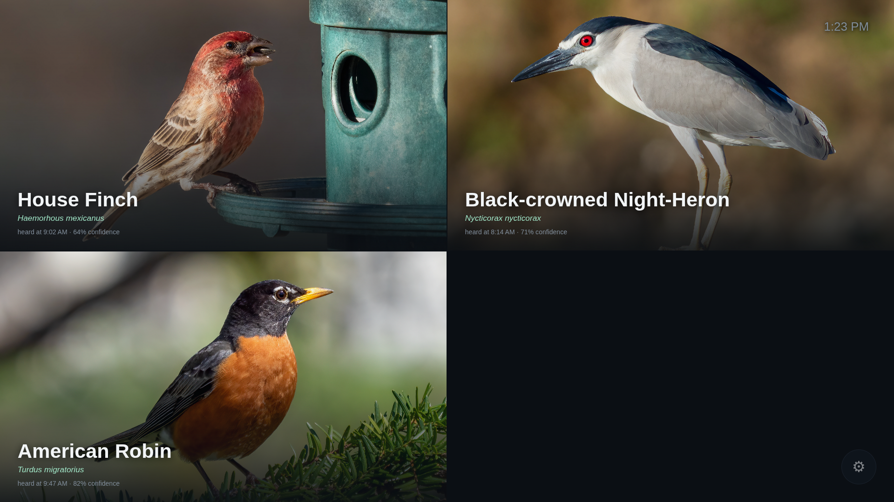
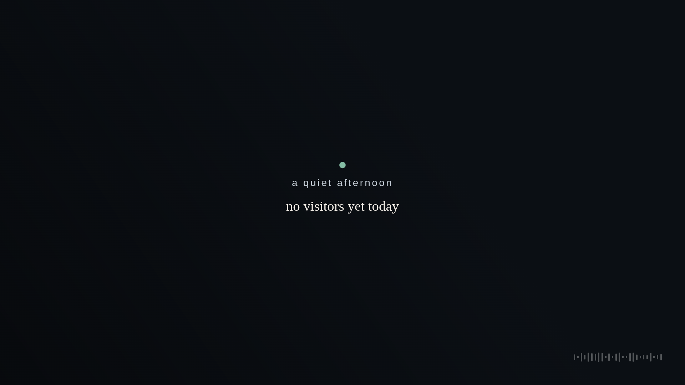

# 🐦 Birdsong

A Raspberry Pi listens to a USB microphone, identifies bird songs in real time
with [BirdNET](https://github.com/kahst/BirdNET-Analyzer), and shows the bird —
photo, name, and confidence — on a full-screen display (e.g. a projector).

- **`app.py`** — the real thing: runs continuous detection in a background
  thread *and* serves a live full-screen web page with a multi-bird grid and a
  runtime control panel.
- **`live_detect.py`** — a minimal terminal-only version that just prints
  detections. Handy for quick checks.

## What it looks like

The display is designed as calm, ambient technology. A single bird emerges from a
soft colour haze derived from its own photo, with its name lower-left and the time
it was last heard — here, an American Robin heard at dawn:



When no birds are calling it settles into a quiet "listening" state with the day's
tally, so the wall always glows gently rather than going blank:



<sub>Bird photos via [Wikimedia Commons](https://commons.wikimedia.org).</sub>

## Hardware

- Raspberry Pi 5 (a Pi 4 also works; no AI accelerator needed — BirdNET runs on
  the CPU in ~0.2 s per 3 s window)
- USB microphone (any class-compliant USB audio input; the Pi has no analog mic in)
- A display via HDMI (Pi 5 uses **micro-HDMI** → you need a micro-HDMI→HDMI cable)

## Software setup (on the Pi)

Debian 13 (trixie) ships Python 3.13, but the BirdNET stack needs **Python 3.11**
(no good `tflite-runtime` aarch64 wheel for 3.13). We use [`uv`](https://github.com/astral-sh/uv)
to provide 3.11 and create the venv.

```bash
# 1. install uv (user-local, no system changes)
curl -LsSf https://astral.sh/uv/install.sh | sh
export PATH="$HOME/.local/bin:$PATH"

# 2. project + Python 3.11 venv
mkdir -p ~/birdsong && cd ~/birdsong
# (copy app.py, live_detect.py, requirements.txt here)
uv venv --python 3.11

# 3. install deps (numpy<2 is critical — see requirements.txt)
uv pip install -r requirements.txt
```

> **Why `numpy<2`?** `tflite-runtime` 2.14.0 is compiled against NumPy 1.x and
> crashes under NumPy 2 (`_ARRAY_API not found`). The pin in `requirements.txt`
> keeps the whole stack consistent.

## Find your microphone

```bash
arecord -l        # note the card number, e.g. "card 2"
```

`app.py` defaults to ALSA device `plughw:2,0`. Override with `--device` if yours
differs.

## Run

```bash
# quick terminal test
.venv/bin/python live_detect.py --min-conf 0.5

# the full display app
.venv/bin/python app.py --min-conf 0.5            # testing: no location filter
.venv/bin/python app.py --min-conf 0.5 --location # real install: filter to your area
```

Then open **http://<pi-hostname>.local:8000** — in a browser on your network to
preview, or in Chromium kiosk mode on the Pi for the projector.

Set your location in `app.py` (`--lat` / `--lon`, defaults to San Francisco) so
the filter knows which species are plausible.

## Run as a service (survives crashes + reboot)

```bash
mkdir -p ~/.config/systemd/user
cp birdsong.service ~/.config/systemd/user/
systemctl --user daemon-reload
systemctl --user enable --now birdsong.service
sudo loginctl enable-linger "$USER"   # start on boot without an active login
```

Check it: `systemctl --user status birdsong.service` and `curl localhost:8000/state`.

## Kiosk on a projector / TV (HDMI)

On Raspberry Pi OS (Wayland/labwc desktop with autologin), boot straight into a
full-screen browser showing the display:

```bash
cp kiosk/labwc-autostart ~/.config/labwc/autostart
sudo reboot
```

On boot the Pi autologins, waits for the web server, and launches Chromium in
kiosk mode (auto-restarted via `lwrespawn`). The connected display (e.g. an
Anker Nebula) must be **powered on and set to its HDMI input** when the Pi boots
so it gets detected. Remove `~/.config/labwc/autostart` to restore the normal
desktop.

> Pi 5 has **micro-HDMI** ports; the one nearest the USB-C jack is `HDMI0`.

## The display

- **Multi-bird grid** — when several species are heard within the hold window,
  the screen splits responsively (2 = side by side, up to 6 in a grid).
- **Ambient mode** — fades to a calm "Listening" screen with today's tally when
  it's quiet.
- **Control panel (⚙, bottom-right)**:
  - **Local filter** — only show species plausible at your location/season.
  - **Min confidence** — raise to cut false positives.
  - **Clear** — reset the screen to Listening.

### Confidence & the location filter

- **Higher confidence** = fewer false positives. `0.5` is a good default.
- **Local filter ON** = only birds that actually occur at your location are shown
  — the best false-positive killer for a real installation. (It will also reject
  recordings of out-of-area birds you play for testing, which is expected.)
- For the wall display, run with `--location` and leave it on.

## Detection log & HTTP API

Every detection is logged to a local SQLite database (`birdsong.db`, next to
`app.py`). It's text-only (no audio), so it stays tiny — roughly 50–100 MB per
year — and is kept indefinitely. The app exposes read-only JSON endpoints for
stats; query them from any browser or script on your network.

### `GET /today`

Today's species with counts, first/last heard, and peak confidence.

```bash
curl http://birdpi.local:8000/today
```
```json
{
  "date": "2026-06-17",
  "species_count": 3,
  "detections": 6,
  "species": [
    {"common": "American Robin", "scientific": "Turdus migratorius",
     "count": 3, "first": "6:31 AM", "last": "8:14 AM", "max_confidence": 0.85}
  ]
}
```

### `GET /history`

Rolling-window summary. Optional `days` (default 14, max 365):

```bash
curl "http://birdpi.local:8000/history?days=7"
```
```json
{
  "days": 7, "from": "2026-06-11", "to": "2026-06-17",
  "totals": {"detections": 8, "species": 4},
  "daily": [{"date": "2026-06-17", "detections": 6, "species_count": 3}],
  "top_species": [{"common": "American Robin",
                   "scientific": "Turdus migratorius", "count": 4}]
}
```

Pass `date=YYYY-MM-DD` instead to drill into one day's species breakdown
(same shape as `/today`):

```bash
curl "http://birdpi.local:8000/history?date=2026-06-16"
```

### `GET /state`

The live display feed (current bird(s), today's tally, clock, config) — polled
by the kiosk page every 1.5 s. Returned fields: `mode` (`bird`/`idle`), `birds`,
`today`, `species_today`, `clock`, `config`.

> Write endpoints also exist for the control panel — `POST /control`
> (`min_conf`, `use_location`), `POST /clear`, and `POST /demo` (inject species
> for screenshots). These change live state but are not part of the read API.

## Notes & gotchas

- Run only one instance — two processes contend for the single USB mic and
  detection stalls. Use the systemd service; don't launch by hand alongside it.
- Don't `kill -9` the recording process — it can lock the USB capture device.
  Use `systemctl stop` / `pkill -TERM`.

## License

MIT (see `LICENSE`), or choose your own.
